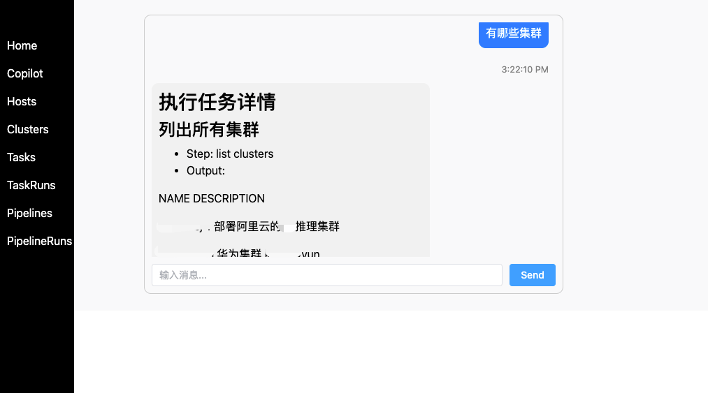

## ops-server

### 功能简介

ops-server 是一个 HTTP 服务，提供了一些 RESTful API，用于对外提供 API 服务。

这样的用途包括：

- 通过 HTTP API 来批量远程执行命令
- 通过 HTTP API 来批量分发文件
- 通过 HTTP API 来创建 Ops Controller CRD 资源

## 关于权限

默认密码是 `P@88w0rd`

可以通过给 Server 服务设置环境变量 `SERVER_TOKEN` 自定义密码。

## 对象管理


## 任务执行


## Copilot

- 在 Ops Server 添加必要的变量

```yaml
- name: SERVER_TOKEN
  value: P@88w0rd
- name: COPILOT_ENDPOINT
  value: https://llmapi.xxx.com/v1
- name: COPILOT_KEY
  value: sk-xxx
- name: COPILOT_OPSSERVER
  value: http://myops-server.ops-system.svc
- name: COPILOT_OPSTOKEN
  value: P@88w0rd
```

其中 `COPILOT_ENDPOINT`、`COPILOT_KEY` 配置与 OpenAI API 兼容的推理接口; `COPILOT_OPSSERVER`、`COPILOT_OPSTOKEN` 是 Ops Server 的地址和 Token。

- 使用 Copilot



直接输入文本，发送相关消息即可。
