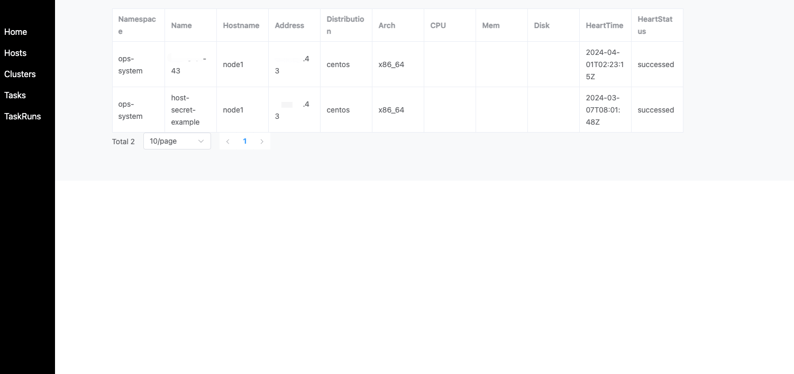
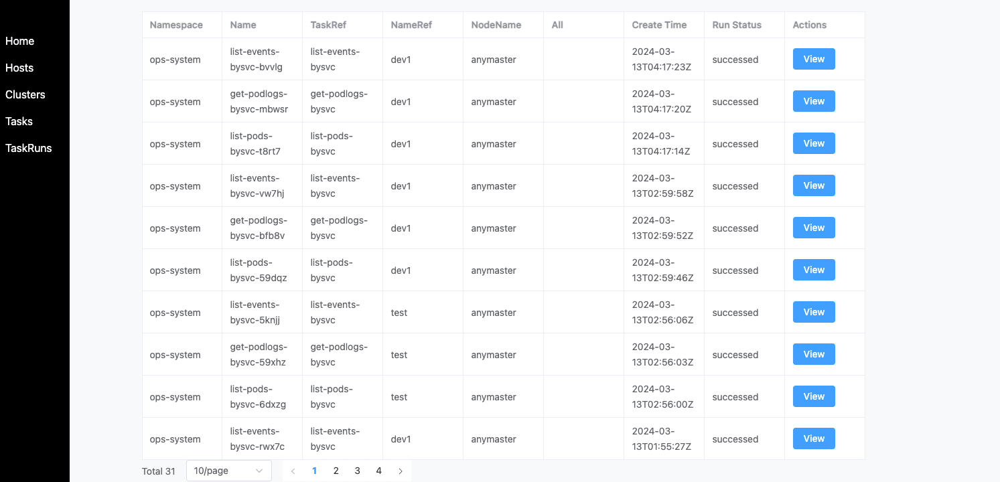

## ops-server

### 功能简介

ops-server 是一个 HTTP 服务，提供了一些 RESTful API，用于对外提供 API 服务。

这样的用途包括：

- 通过 HTTP API 来批量远程执行命令
- 通过 HTTP API 来批量分发文件
- 通过 HTTP API 来创建 Ops Controller CRD 资源

## 关于权限

默认密码是 `P@88w0rd`

可以通过给 Server 服务设置环境变量 `SERVER_TOKEN` 自定义密码。

## 对象管理

## 任务执行

