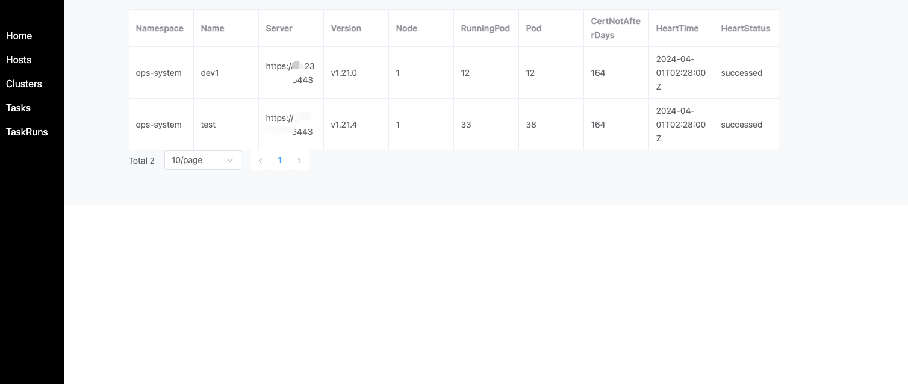
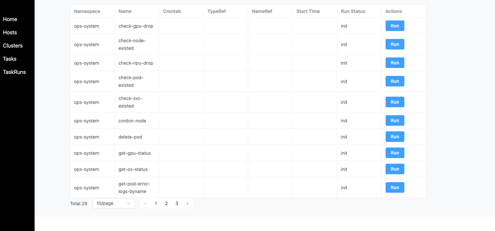
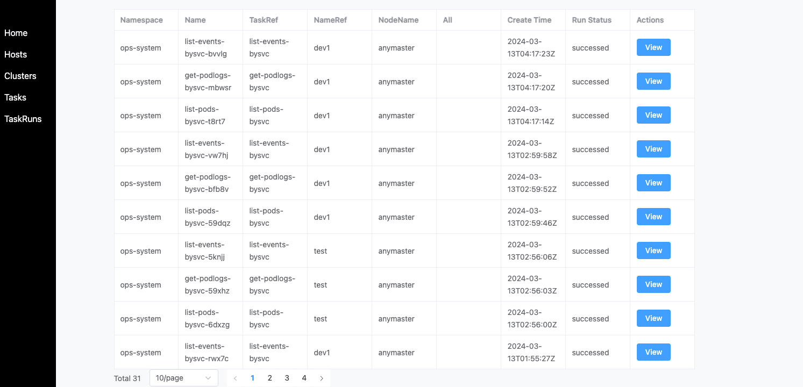

### **ops-server Overview**

`ops-server` is an HTTP service that provides RESTful APIs for interacting with various operations tasks. It can be used for:

- **Remote Command Execution**: Execute commands remotely in bulk via HTTP API.
- **File Distribution**: Distribute files to multiple hosts via HTTP API.
- **Ops Controller CRD Resource Creation**: Create Ops Controller resources (such as `Host`, `Cluster`, `Task`) via HTTP API.

### **Authentication**

By default, the password for accessing the server is `ops`. You can customize this password by setting the `SERVER_TOKEN` environment variable for the server.

### **Object Management**

`ops-server` allows you to manage and view resources like `Cluster`, `Host`, and `Task`, as shown in the following illustrations:

- **Clusters**  
  

- **Hosts**  
  

- **Tasks**  
  

- **Task Runs**  
  

### **Using Copilot with Ops Server**

To integrate `ops-server` with Copilot, add the necessary environment variables:

```yaml
- name: SERVER_TOKEN
  value: ops
- name: COPILOT_ENDPOINT
  value: https://llmapi.xxx.com/v1
- name: COPILOT_KEY
  value: sk-xxx
- name: COPILOT_OPSSERVER
  value: http://myops-server.ops-system.svc
- name: COPILOT_OPSTOKEN
  value: ops
```

#### **Explanation of Variables:**

- `COPILOT_ENDPOINT` and `COPILOT_KEY`: Configurations for the inference interface compatible with OpenAI's API.
- `COPILOT_OPSSERVER` and `COPILOT_OPSTOKEN`: The address and token for accessing the `ops-server`.

#### **Using Copilot in Web Interface**

After setting up Copilot, you can interact with it directly through a web interface:

1. Enter your task or query in text form.
2. Copilot will process the request and interact with the `ops-server` to perform the necessary actions.

This provides a streamlined way to manage tasks and operations directly from the web interface.
