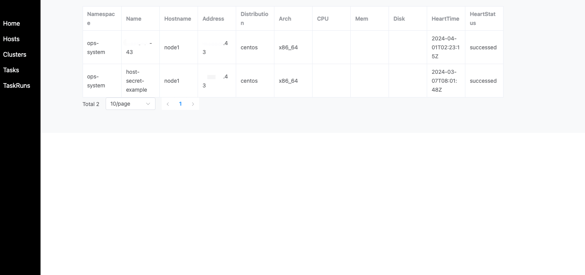

### **ops-server Overview**

`ops-server` is an HTTP service that provides RESTful APIs for interacting with various operations tasks. It can be used for:

- **Remote Command Execution**: Execute commands remotely in bulk via HTTP API.
- **File Distribution**: Distribute files to multiple hosts via HTTP API.
- **Ops Controller CRD Resource Creation**: Create Ops Controller resources (such as `Host`, `Cluster`, `Task`) via HTTP API.

### **Authentication**

By default, the password for accessing the server is `ops`. You can customize this password by setting the `SERVER_TOKEN` environment variable for the server.

### **Object Management**

`ops-server` allows you to manage and view resources like `Cluster`, `Host`, and `Task`, as shown in the following illustrations:

- **Clusters**  
  

- **Hosts**  
  

- **Tasks**  
  

- **Task Runs**  
  

