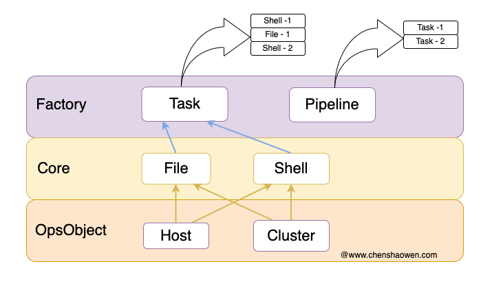
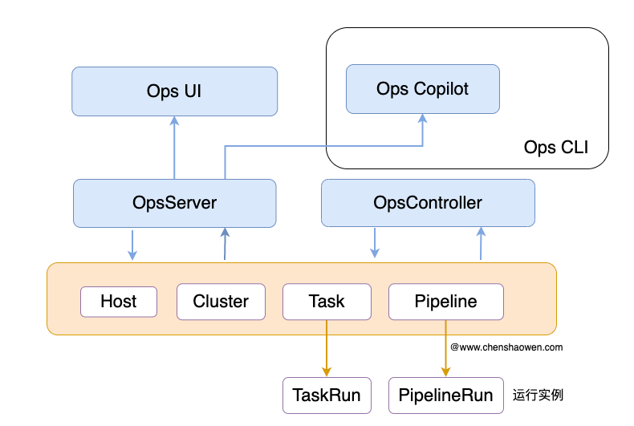
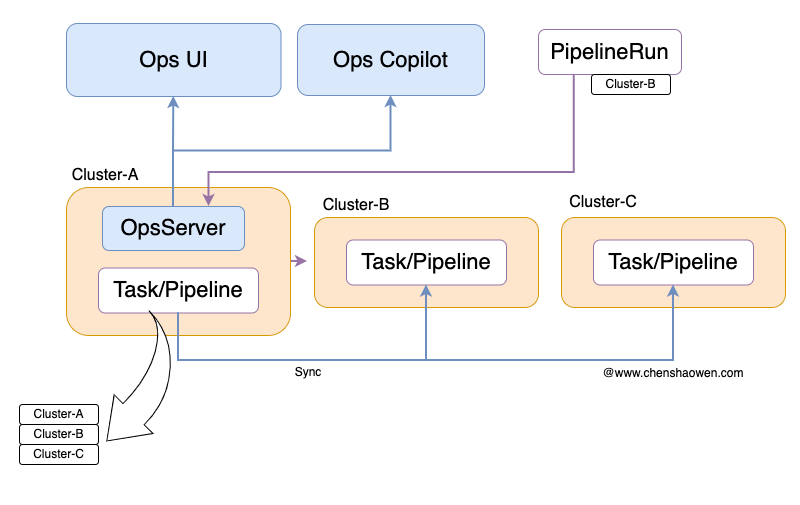
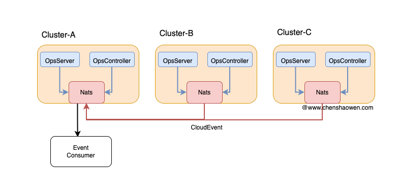

## Ops

Ops 是一个运维工具项目。它的目标是提供一个简单的运维工具，让运维人员可以快速地完成运维工作。

## 生产实践

- 日构建 2k+ 的 CICD 集群
- 海外集群 40+ 个集群
- AI 算力集群 20+ 个集群
- 支持 ARM、X86 架构

## 设计

### 对象定义

- Host，主机。可以是云主机、裸金属机器，通过 SSH 能够访问到的机器。
- Cluster，Kubernetes 集群。通过 `kubectl` 能够访问的 Kubernetes 集群。
- Task，组合多个 File 和 Shell 的任务。
- Pipeline，组合多个 Task 的任务。

### 核心操作

- File，文件的上传和下发。
- Shell，执行脚本。

## 组件

- **ops-cli**：是可以单独使用的命令行工具，辅助运维人员在命令行终端完成一些自动化的运维工作
- **ops-server**：一个 HTTP 服务，用于提供 HTTP API，提供有一个 Dashboard 的界面
- **ops-controller**：以 Operator 的形式管理主机、集群、任务、流水线等资源

## 多集群支持

在实践中，建议：

- 将当前集群的主机创建为 Host
- 可以创建多个 Cluster，拥有的 Cluster 对象即为纳管的集群

Task、Pipeline 对象会自动同步到集群下的全部 Cluster 集群中，无需人工触发。

当下发一个流水线任务时，需要创建一个 PipelineRun 对象。PipelineRun 是可以跨集群的，而 TaskRun 不行。

Controller 会根据 PipelineRun 中设置的 cluster 字段，将 PipelineRun 分发到指定的集群中，由集群内的 Controller 执行具体的任务，再将 PipelineRun 的状态更新到主集群内的 PipelineRun 对象中。

## 事件驱动

建议在每个集群中安装一个 Nats 组件，通过边缘集群的模式，可以将全部的事件汇总到一个集群，或者若干个网络分区的集群。

在事件中，主要定义了以下 Topic:

- **探活类**：每个主机、集群会有定时检测，能够看到探活的事件
- **执行任务类**：执行 TaskRun、PipelineRun 任务的事件
- **巡检类**：TaskRun 执行定时任务巡检任务时，会推送相关的检测事件
- **Webhook 类**：用户自定义的一些运维事件，告警、通知等
