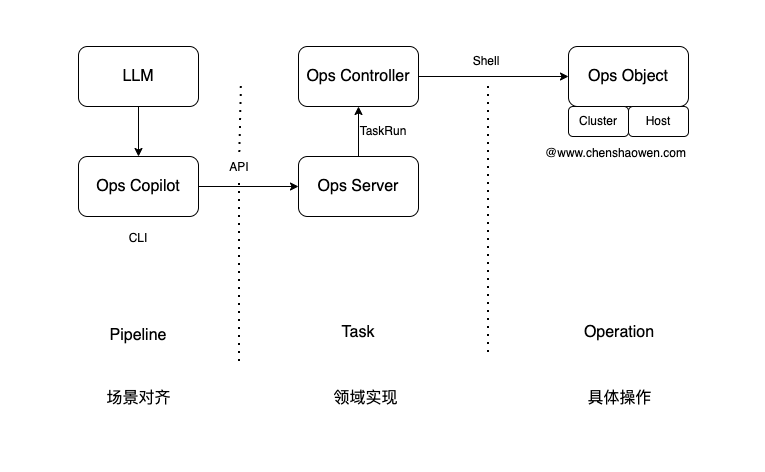

## opscli

### 功能简介

- 批量远程执行命令

- 批量分发文件

- 创建 Ops Controller CRD 资源

主要分为三类 CRD 资源: `Host`, `Cluster`, `Task`

### Copilot 介绍

Ops Copilot 是借助于 LLM 整合 Ops 能力的一个 CLI 子命令。主要想解决以下问题:

- 如何选择合适的 Task 来解决问题
- 如何选择合适的 Task 参数解决问题
- 将 Ops 和 LLM 的操作入口统一，避免切换
- 如何提高 LLM 对齐 Ops 的能力

下图是 Ops Copilot 的设计图:

通过 Pipeline 定义，描述场景，借助 LLM 将文本转换为具体的 Pipeline 和相关参数。Ops Copilot 会解析 Pipeline 并执行 Task 任务。

Ops Copilot 通过 Ops Server 与 Ops Controller 交互，创建 TaskRun 任务等待 Ops Controller 执行完成，并获取结果。

Ops Controller 会 Watch TaskRun 的创建，根据其中指定的 Cluster 或者 Host 对象，拿到相关的凭证连接 Ops Obsject 对象，执行相关操作。

### 支持的操作系统

- Linux
- macOS
